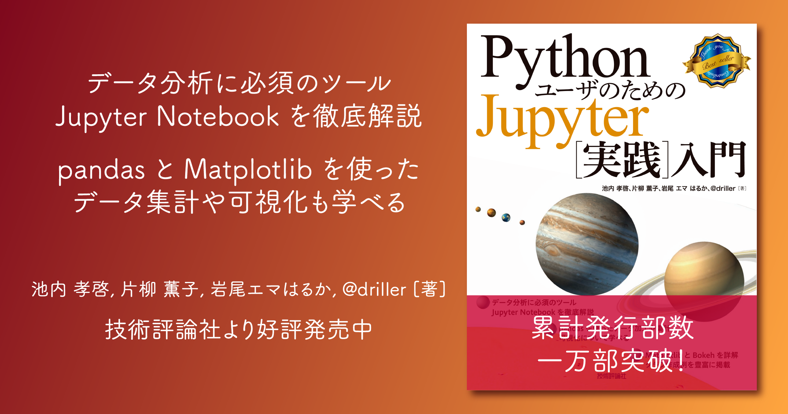

# PythonユーザのためのJupyter［実践］入門

* [書籍公式ページ](https://gihyo.jp/book/2017/978-4-7741-9223-9)
* [公式サポートページ（正誤表）](https://gihyo.jp/book/2017/978-4-7741-9223-9/support)　

## サンプルコードについて

* 書籍に掲載されているコードとはレイアウト（改行位置など）が異なる部分がありますが、内容は同じものです
* コードに問題点などがあった場合は [issues](https://github.com/practical-jupyter/sample-code/issues) にご連絡ください
* 書籍と異なるバージョンでは動作しないコードがあります（6-7章など）

## サンプルコード

* nbviewer: [nbviewer](https://nbviewer.jupyter.org)でレンダリングされたものが表示されます
* Open in Colab: [Colaboratory](https://colab.research.google.com/)上で実行できます

### 第3章 pandasでデータを処理しよう

章-節|タイトル|nbviewer|Open in Colab
-----|--------|--------|-------------
3-2|サンプルデータの説明||
3-3|Series||
3-4|DataFrame||
3-5|さまざまなデータの読み込み||
3-6|データ処理||
3-7|統計量の算出||
3-8|クロス集計||
3-9|時系列データの処理||
3-10|データ可視化||

### 第4章 Matplotlibでグラフを 描画しよう

章-節|タイトル|nbviewer|Open in Colab
-----|--------|--------|-------------
4-2|グラフ描画の基礎 ||
4-3|折れ線グラフ||
4-4|散布図||
4-5|棒グラフ||
4-6|ヒストグラム||
4-7|箱ひげ図||
4-8|円グラフ||

### 第5章 Matplotlibを使いこなそう

章-節|タイトル|nbviewer|Open in Colab
-----|--------|--------|-------------
5-1|さまざまな図形の描画||
5-2|フィギュアオブジェクトとサブプロットの調整||
5-3|色の指定とカラーマップ||
5-4|線の書式設定||
5-5|フォントとテキストボックスの書式設定||
5-6|グラフの軸と目盛りの設定||
5-7|凡例とタイトル||
5-8|描画スタイル||
5-9|ファイル出力||
5-10|show()関数とオブジェクト指向スタイル||

### 第6章 Bokehでグラフを描画しよう

章-節|タイトル|nbviewer|Open in Colab
-----|--------|--------|-------------
6-2|Bokehの特長||
6-3|グラフ描画の基礎||
6-4|折れ線グラフ||
6-5|散布図||
6-6|棒グラフ||
6-7|ヒストグラム||
6-8|箱ひげ図||
6-9|円グラフ||

### 第7章 Bokehを使いこなそう

章-節|タイトル|nbviewer|Open in Colab
-----|--------|--------|-------------
7-1|さまざまな図形の描画||
7-2|さまざまなオブジェクトの調整||
7-3|色の調整||
7-4|さまざまな線の調整||
7-5|テキストの調整||
7-6|図の調整||
7-7|図形の調整||
7-8|軸の調整||
7-9|軸書式の調整||
7-10|目盛り線の調整||
7-11|凡例の調整||
7-12|複数の図のレイアウト調整||
7-13|プロットツールを活用した対話的な操作||
7-14|動的・対話的なグラフ作成||

### Appendix

章-節|タイトル|nbviewer|Open in Colab
-----|--------|--------|-------------
A-1|対話型インタフェースの「ipywidgets」||
